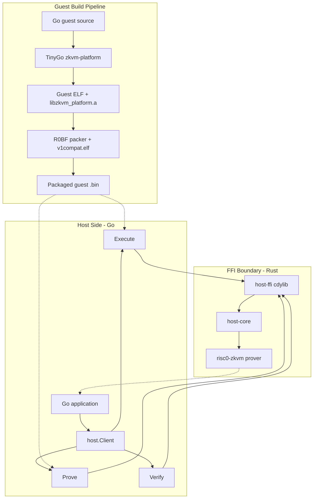
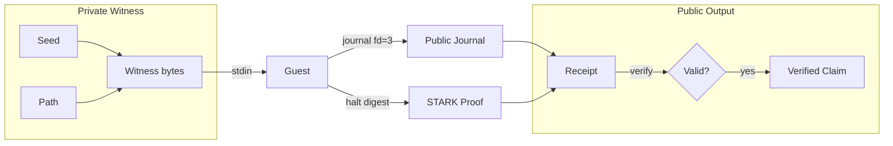

# go-zkvm

`go-zkvm` is a TinyGo-first toolkit for writing zero-knowledge guest programs
in Go and proving them with the RISC Zero zkVM. A guest runs inside the VM,
reads private input, computes on it, and commits public output. The proof
guarantees the computation was done correctly without revealing the private
input.

Write a guest:

```go
package main

import "github.com/roasbeef/go-zkvm/zkvm"

func main() {
    // Private witness: only the prover sees these.
    var a, b uint64
    zkvm.ReadValue(&a)
    zkvm.ReadValue(&b)

    // Public claim: the verifier sees the product.
    product := a * b
    zkvm.CommitValue(&product)
    zkvm.Halt(0)
}
```

Prove and verify it from Go:

```go
guest, _ := host.ReadGuestFile("./multiply.bin")

client, _ := host.New()
defer client.Close()

result, _ := client.Prove(host.ProveRequest{
    GuestBinary: guest,
    Stdin:       witnessBytes,
}, host.WithReceiptKind(host.ReceiptKindSuccinct))

verified, _ := client.Verify(host.VerifyRequest{
    Receipt:         result.Receipt,
    ImageID:         result.ImageID,
    ExpectedJournal: result.Journal,
})
```

The goal is not "make one demo work", but "make Go a repeatable guest language
for risc0".

## Architecture



## Data Flow



## What This Repo Provides

- `zkvm/`: guest-side Go API: read private input, commit public journal
  output, journal digest finalization, recursive assumption helpers, cycle
  counting
- `host/`: typed Go host API for `ComputeImageID`, `Execute`, `Prove`, and
  `Verify`, backed by the Rust proving engine via FFI
- `examples/`: three sample guests (simple, multiply, policy_check)
- `host-core/` + `host-ffi/`: shared Rust host logic and cdylib boundary
- `go-guest-host/`: Rust reference CLI for debugging and validation
- `convert_to_r0bf.go` / `extract_r0bf.go`: R0BF guest binary packer and
  unpacker
- `docs/`: architecture notes, tutorial, host API reference, and runbooks

## Current Status

The working path in this repo is the current upstream-aligned lane:

- TinyGo is rebased on upstream `v0.40.1` in the sibling `tinygo-zkvm` repo
- risc0 is rebased on current `main` in the sibling `risc0` repo
- guest builds link against upstream `libzkvm_platform.a`
- Go guests execute, prove, and verify locally
- the FFI-backed `host` package now executes, proves, and verifies locally
- composed guests can register receipt assumptions through `zkvm.Verify(...)`,
  and the host API can supply succinct assumption receipts on execute/prove
  runs
- `host.Prove` defaults to composite receipts and also supports optional
  succinct receipts through `WithReceiptKind`
- Apple Silicon proving is confirmed to use the Metal-backed prover path

Historical notes on the older handwritten syscall path still exist in `docs/`,
but the supported user-facing flow in this repo is the archive-linked one.

## Supported Sample Set

The current validated sample set is:

- `simple`
  - execute-only: verified
  - prove+verify: verified
  - current deterministic image ID: `9ac42ea490374af40aa6ca499952a133edb38df51a314b47041bf06576494f2e`
  - current proof seal size: `203016` bytes
- `multiply`
  - prove+verify: verified
  - current deterministic image ID: `db8cb4b1a0a6045cc3e64f1eb6f2927eadd73f33bbceb261b91da1b3068e10f2`
  - committed public output: `391`
  - current proof seal size: `203016` bytes
- `policy_check`
  - execute-only: verified
  - prove+verify: verified
  - current deterministic image ID: `78e9677b5db05ea0a2a5de33c54f85d5ba1724364f8f73c150949066753144ac`
  - current proof seal size: `203016` bytes
  - built-in public summary:
    - item count `3`
    - approved `true`
    - subtotal `245`
    - discount `20`
    - total `225`
    - limit `250`

## Intended Repository Layout

The intended sibling layout is:

```text
github.com/roasbeef/
├── risc0
├── tinygo-zkvm
├── go-zkvm
└── bip32-pq-zkp
```

`go-zkvm` depends on `risc0` and `tinygo-zkvm` being checked out next to it.

## Quick Start

### Prerequisites

- Go `1.24.4`
- Rust toolchain compatible with the checked-out `risc0` tree
- sibling checkouts of:
  - `../risc0`
  - `../tinygo-zkvm`
- on Apple Silicon, a working local Metal environment is recommended for proof
  speed

Fresh-clone notes:

- in `../tinygo-zkvm`, run `git submodule update --init --recursive`
- in `../tinygo-zkvm`, run `make llvm-source` once before the first
  external-LLVM build so the repo-local Clang/LLD headers are present
- in `../risc0`, run `git lfs pull` before the Rust host/prover build

If your default `go` in `PATH` is newer than TinyGo currently supports on this
lane, set:

```bash
export GO_GOROOT=/path/to/go1.24.4
```

before running `make`.

### Build Sample Guests

From the repo root:

```bash
make platform-standalone
make simple
make multiply
make policy-check
```

These targets compile with TinyGo target `zkvm-platform`, link against
`libzkvm_platform.a`, and package the final `.bin` guest image.

`make platform-standalone` proxies to the sibling `risc0/examples/c-guest`
target that builds a deterministic platform archive from the published git
commit. That is now the preferred path when you want stable guest artifacts
across different `risc0` checkout directories.

To rebuild and run the currently supported sample set end to end:

```bash
make verify-samples
```

That target runs the reference CLI in `go-guest-host/` against the published
sample guests. It proves and verifies inline, but does not persist receipt
files by default.

To build and validate the FFI-backed Go host layer:

```bash
make host-ffi
make test-host-ffi
```

### Reference CLI: Execute Without Proving

From `go-guest-host/`:

```bash
cargo run --release -- ../simple.bin --raw-journal --execute-only
```

Use this path when you want the Rust reference CLI directly. For normal Go
integration, prefer the typed `host/` package.

### Reference CLI: Prove And Verify

From `go-guest-host/`:

```bash
cargo run --release -- ../simple.bin --raw-journal
```

The host computes the image ID, runs the configured risc0 prover backend,
verifies the receipt, and prints the committed journal bytes plus the receipt
proof seal size. The current validated lane for this repo is local proving.
This reference CLI validates the proof inline and prints receipt metadata, but
does not write a receipt file unless you add that behavior yourself.

## Go Host API

The host-side Go package is:

```text
github.com/roasbeef/go-zkvm/host
```

Library loading policy:

- `host.WithLibraryPath(...)` is the strongest override
- otherwise `host` checks `GO_ZKVM_HOST_LIBRARY_PATH`
- otherwise it falls back to the sibling-layout build path under
  `host-ffi/target/release/`

If you want proof artifacts on disk from the Go API, persist
`proveResult.Receipt` yourself and write any verifier-facing metadata alongside
it.

Important boundary note:

- the public Go API is typed and byte-oriented
- the Rust `cdylib` underneath uses a small JSON-over-buffer ABI internally
- that JSON layer is only the control envelope between Go and Rust
- it is not part of the guest witness format, journal format, or receipt format

For the full API reference, see `docs/host-api.md`.

## What Had To Change In TinyGo

Getting Go onto the zkVM required more than adding a target JSON:

- a TinyGo target that matches the risc0 guest memory map
- startup/runtime wiring that works for the zkVM environment
- task stack/runtime build-tag fixes for TinyGo's RISC-V runtime selection
- a reliable way to link upstream `libzkvm_platform.a`
- a clean split between the legacy handwritten-syscall path and the newer
  archive-linked path

The short consumer-oriented version is documented here:

- `docs/tinygo-zkvm-target.md`

The sibling `tinygo-zkvm` repo carries the fork-local deep dive for the actual
patches.

## Documentation

Start with:

- `docs/tutorial.md`: guided walkthrough from first guest to real application
- `docs/host-api.md`: full Go host API reference
- `docs/go-zkvm-overview.md`: end-to-end architecture
- `docs/README.md`: reading order and topic map
- `docs/running.md`: build, execute, prove commands
